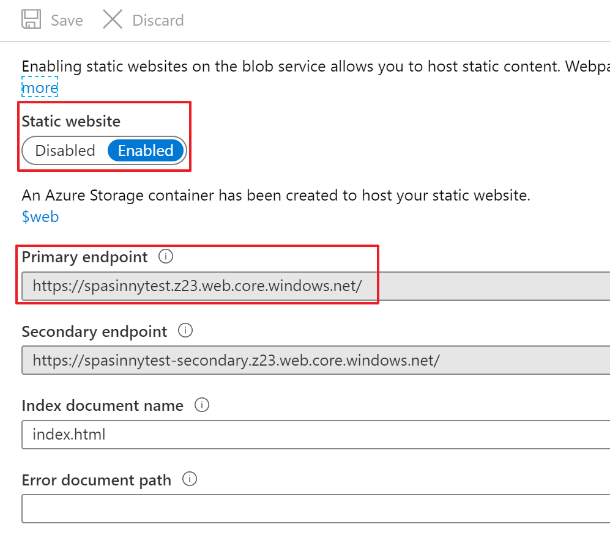
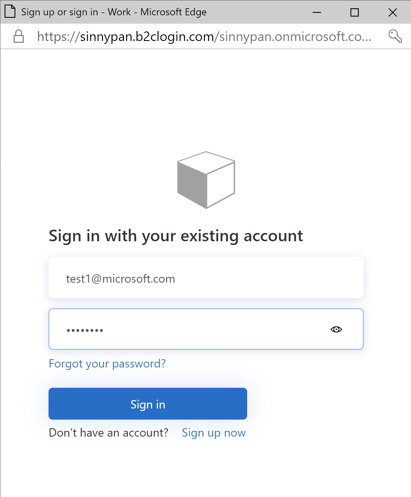
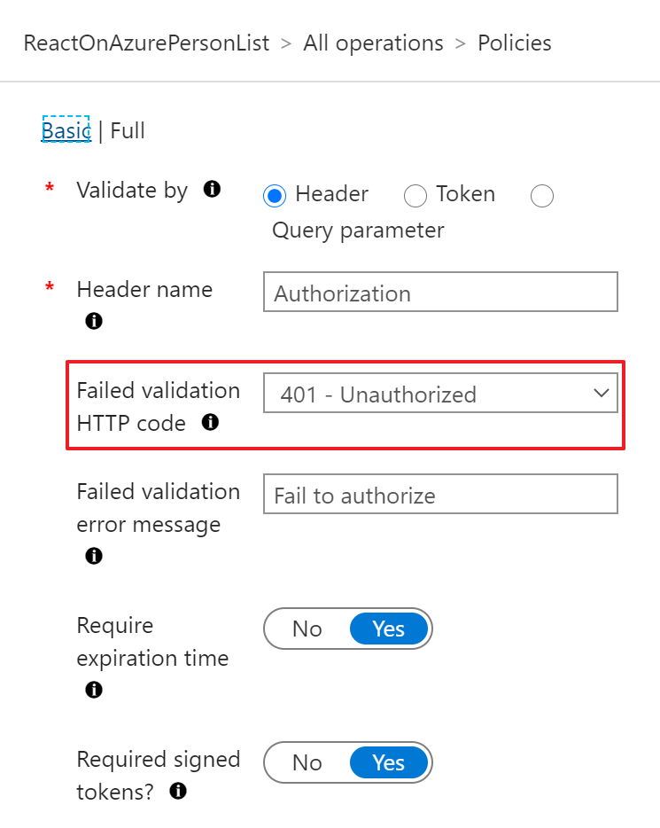
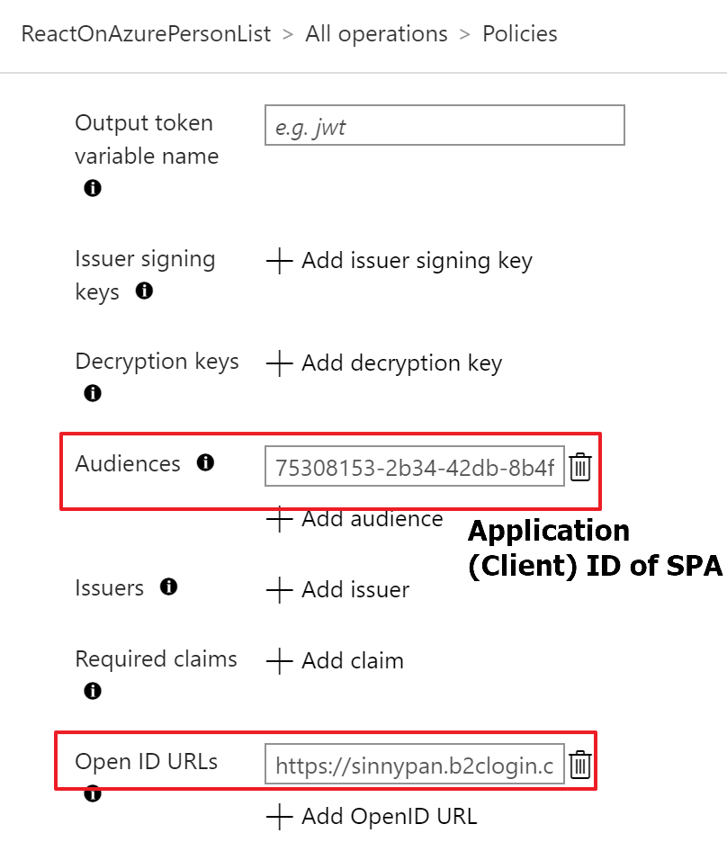
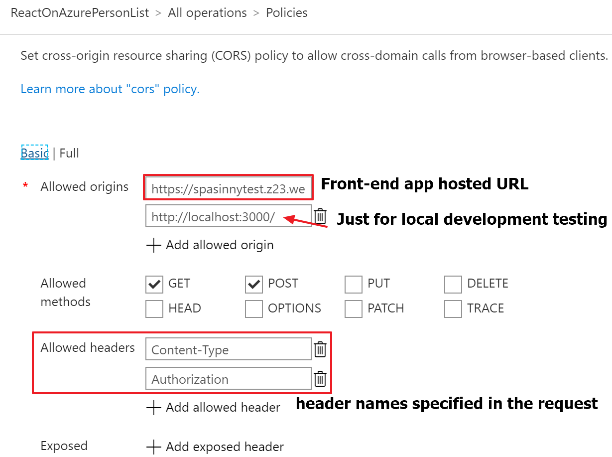

# React on Azure
This repository for developers who want to know..
- How to host React app on Azure
- How to make connection secure between front-end and back-end with Azure features

## Background
SPA is popular in the web development world, but there are few documents/contents to describe how to host production app with Azure features. In addition to it, my customers and I are intersted in hosting SPA on Azure, so we create this sample app.

## What you can see with demo
TODO: Will paste screen shot here because it makes reader to understand what they try to reach easily

# Technical consideration
## Architecture

## Language, SDK and utilities
We uses following language and tools. As prerequistics, please read and try each tools tutorial.

### Programming language
- [TypeScript](https://www.typescriptlang.org/): JavaScript with type

### Tools for single page application
- [React](https://reactjs.org/): JavaScript library for building SPA.
- [Jest](https://jestjs.io/): JavaScript testing framework. We use it for testing both React components and other codes.
- [Enzyme](https://enzymejs.github.io/enzyme/): JavaScript testing utility for react. We use it for testing React components. This tool make us to write test for custom component easily.
- [MSAL](https://github.com/AzureAD/microsoft-authentication-library-for-js): Microsoft Authentication library. We can get idToken with this SDK and Azure Active Directory. We want to utilize idToken for making secure connection between front-end and back-end. 
- [Microsoft Fluent UI](https://developer.microsoft.com/en-us/fluentui): We can utilize reusable React components made by Microsoft. This is used in Office 365 and other Microsoft product.
- [SPA Hosted On Azure Blob Storage](https://docs.microsoft.com/en-us/azure/storage/blobs/storage-blob-static-website-host#configure-static-website-hosting): After configured/enabled static-website setting on the Blob storage, you can easily upload your web content of SPA to `$web` container, then you can access the SPA through the provided endpoint like below:

### Tools for user authentication
- [Azure Active Directory B2C](https://docs.microsoft.com/en-us/azure/active-directory-b2c/): we can utilize AAD B2C to setup and enable required authentication and authorization quickly. In this sample project, we demostrated using basic **Sign-Up-and-Sign-In** flow as entry point of SPA.
If you're interested in using AAD B2C, please follow below instructions provided by Microsoft to complete setup of Azure AD B2C.
1. [Create B2C Tenant](https://docs.microsoft.com/en-us/azure/active-directory-b2c/tutorial-create-tenant): create a tenant that manage users and groups in Azure AD.
2. [Register an Application](https://docs.microsoft.com/en-us/azure/active-directory-b2c/tutorial-register-applications?tabs=applications): register your application that want to interact with AAD B2C and provide Redirect URI for your application.
3. [Create User Flows](https://docs.microsoft.com/en-us/azure/active-directory-b2c/tutorial-create-user-flows): you can create different user flows for different security purposes. In this project, we're creating **Sign-Up-and-Sign-In** flow, so in the beginning of SPA, it will show login page like below:

### Tools for token validation and cors setting
- [Azure API management](https://azure.microsoft.com/en-us/services/api-management/): PaaS service to protect backend APIs. We utilize it to block anonymous request. Backend app returns response if the request has correct idToken.

If you're new to Azure API management, please follow below instructions provided by Microsoft to complete setup of Azure APIM.
1. [Create API management service instance](https://docs.microsoft.com/en-us/azure/api-management/get-started-create-service-instance)
2. [Import Function App as API](https://docs.microsoft.com/en-us/azure/api-management/import-function-app-as-api)
3. [How to setup validate token policy](https://docs.microsoft.com/en-us/azure/api-management/api-management-access-restriction-policies#ValidateJWT): in this sample, we're configuring validation policy like below: getting token from `Authorization` header, validating `expiration time, signed tokens, audiance` of AAD B2C token
 
4. [How to setup CORS policy](https://docs.microsoft.com/en-us/azure/api-management/api-management-cross-domain-policies#CORS): in this sample, we're add CORS policy like below: Allow domain of frond-end application (SPA) to access with header name: `Authorization` and `Content-Type`

### Tools for backend
- [Azure Functions](https://azure.microsoft.com/en-us/services/functions/): Serverless platform to run your code. In this repo, we just created simple http endpoint to return dummy data. In production, you can utilize data layer such as Azure Cosmos DB, Azure Storage Table and more. For keeping sample simple, we don't use data layer.
