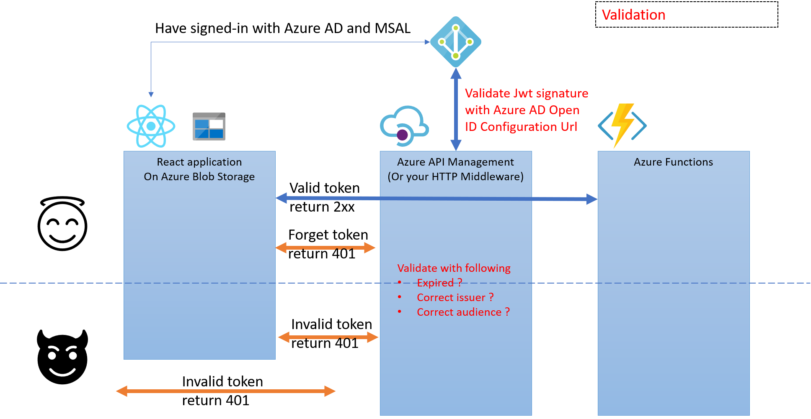

# React on Azure
This repository for developers who want to know..
- How to host React app on Azure
- How to make connection secure between front-end and back-end with Azure features

## Background
SPA is popular in the web development world, but there is few documents/contents to describe how to host production app with Azure features. In addition to it, I and my customers are intersted it to host it on Azure, so we create this sample app.

## What you can see with demo
TODO: Will paste screen shot here because it makes reader to understand what they try to reach easily

# Technical consideration
## Architecture

## Language, SDK and utilities
We uses following language and tools. As prerequistics, please read and try each tools tutorial.

### Programming language
- [TypeScript](https://www.typescriptlang.org/): JavaScript with type

### Tools for single page application
- [React](https://reactjs.org/): JavaScript library for building SPA.
- [Jest](https://jestjs.io/): JavaScript testing framework. We use it for testing both React components and other codes.
- [Enzyme](https://enzymejs.github.io/enzyme/): JavaScript testing utility for react. We use it for testing React components. This tool make us to write test for custom component easily.
- [MSAL](https://github.com/AzureAD/microsoft-authentication-library-for-js): Microsoft Authentication library. We can get idToken with this SDK and Azure Active Directly. We want to utilize idToken for making secure coneection between backend. 
- [Microsoft Fluent UI](https://developer.microsoft.com/en-us/fluentui): We can utilize reusable React components made by Microsoft. This is used in Office 365 and other Microsoft product.

### Tools for token validation
- [Azure API management](https://azure.microsoft.com/en-us/services/api-management/): PaaS service to protect backend APIs. We utilize it to block anonymous request. Backend app returns response if the request has correct idToken.

### Tools for backend
- [Azure Functions](https://azure.microsoft.com/en-us/services/functions/): Serverless platform to run your code. In this repo, we just created simple http endpoint to return dummy data. In production, you can utilize data layer such as Azure Cosmos DB, Azure Storage Table and more. For keeping sample simple, we don't use data layer.
